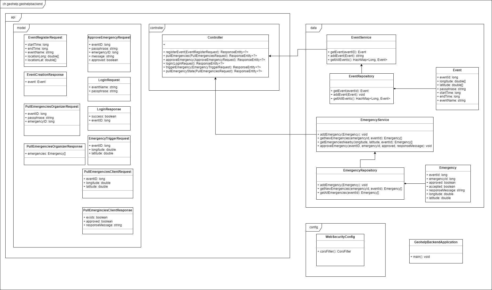

# GeoHelp-Backend

The backend part of the GeoHelp project.
It connects the [GeoHelp-Organizer-App](https://gitlab.ethz.ch/aeggerth/geohelp-organizer-app) with the [GeoHelp-User-App](https://gitlab.ethz.ch/aeggerth/geohelp-user-app), by providing a REST API.
All data is only temporary stored in memory.


## Getting Started
### Prerequisites
Java 17 [jdk](https://openjdk.org/) installation with `JAVA_HOME` path set.

### Installing
Clone this repository.
```
git clone https://gitlab.ethz.ch/aeggerth/geohelp-backedn
cd path/to/repo
```

Run the application in development mode:
> MacOS/Linux
```
./mvnw spring-boot:run
```
> Windows
```
mvnw spring-boot:run
```

Generate `jar` file for production:
> MacOS/Linux
```
./mvnw clean package
```
> Windows
```
mvnw clean package
```

## API documentation
The application provides the following api calls

| Sender    | Endpoint             | Request Method | Description                                        | Params                                     | Response                                    |
|-----------|----------------------|----------------|----------------------------------------------------|--------------------------------------------|---------------------------------------------|
| Organizer | register-event       | POST           | Create event which adds eventId                    | startTime, endTime, geolocation, eventName | passphrase                                  |
| Organizer | pull-emergencies     | POST           | Pull emergencies with ID greater than the one send | passphrase, eventId, emergencyId           | list of emergency options                   |
| Organizer | approve-emergency    | POST           | Approve emergency                                  | passphrase, eventId, emergencyId, message  |                                             |
| Organizer | login                | POST           | Check passphrase                                   | eventName, passphrase                      | boolean whether it is valid or not, eventId |
| Visitor   | trigger-emergency    | POST           | Trigger emergency                                  | eventId, geolocation                       |                                             |
| Visitor   | pull-emergency-state | POST           | Pull response from organizer                       | eventId, geolocation                       | responseMessage, approved, exists           |

The params are always wrapped in a corresponding object, and api returns a response map,
with an `error` field which is set to `false` if everything went fine and `true` otherwise.
The response data, which is wrapped in an according object, is stored in the `data` field of the response map.

More precise information about the wrapper objects can be obtained from the UML-Diagram in the developer documentation.

## Developer documentation
Project structure:


The repository classes `EventRepository.java` and `EmergencyRepository.java` are implemented such that the can mapped to a database with very few modifications.

## Build With
* [Spring Boot](https://spring.io/projects/spring-boot/) - Java framework
* [Spring Boot Starter Web](https://mvnrepository.com/artifact/org.springframework.boot/spring-boot-starter-web) - Starter for building web, including RESTful, applications using Spring MVC
* [Lombok](https://projectlombok.org/) - Java library tool to reduce boilerplate code